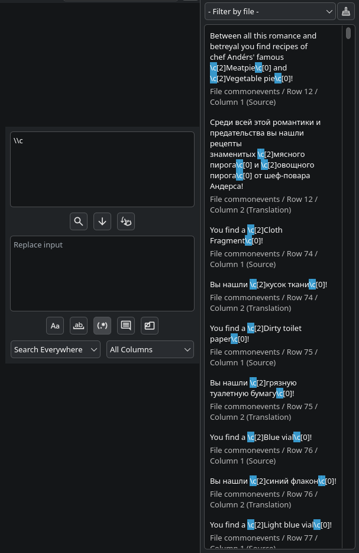

# Search Features

## Search

Search can be used by putting some text in search input, and pressing Enter or search button.

Depending on active search patterns, search will behave differently.

Search is heavily optimized, by storing tightly-packed indices of the matches in-memory, which allows to display millions of matches in one page.

### Search Results Panel

Search results panel is located on the right side of the main window when docked. It can be undocked and made floating.

The panel allows the following interaction for the matches:

- LMB: Navigate to text location
- RMB: Replace matched text with replace input's text
- MMB: Put text from replace input to the translation input of matched source text

Note: Consider testing search patterns on a small subset before performing large-scale replacements.

### Regular Expression Support

It's recommended that you perform regular expression replaces somewhere outside the program, just so you have the ability to easily revert everything.

The application uses [Qt's regular expression implementation](https://doc.qt.io/qt-6/qregularexpression.html), which is essentially [PCRE2](https://www.pcre.org/current/doc/html/pcre2syntax.html).

Here's a quick breakdown over the regex features:

- Unicode in regular expressions is fully supported.
- The following substitutions are allowed:
    - `` \` `` - Inserts the text before the full match.
    - `\'` - Inserts the text after the full match.
    - `\+` - Inserts the last captured group.
    - `\\` - Literal `\`.
    - `\{n}`/`\{nn}` - Inserts the captured group `n`. `\0` is reserved for the full match.

Example of searching for `\c` pattern:

## Replace

Global replace is used to globally replace the text from search input to the text from replace input.

If you're not sure about replacing, first use the search, browse the search results, and if you're sure that everything is okay, use global replace. You can also perform single replace, by clicking one of the search results with right mouse button.

Depending on active search patterns, search will behave differently.

## Put

Global put is used to globally put the text from replace input to the translation textarea, if source text of that textarea matches the text in search input.

Put is an extremely dangerous feature, as it will replace the existing translation in a textarea. So make sure you won't overwrite something important with it. You can also perform single put, by clicking one of the search results with middle mouse button.

Global put behaves slightly different from search, as it will match from the start of the string to the end of the string.

For example, if you want to put text to the textarea, that corresponds to `Hello` source text, you must type `Hello` to the search input, and this won't match any string, that has something else than `Hello` in it.

For powerful puts, you can use regular expressions. They also match from the start of the string to the end of the string, but you can account for that using greedy `*` or `+` modifiers. For example, `Hello .+` will match both `Hello World`, `Hello Rust`, `Hello Whatever` etc.

If you're not sure about put, first use the search, browse the search results, and if you're sure that everything is okay, use global put.

Depending on active search patterns, search will behave differently.
